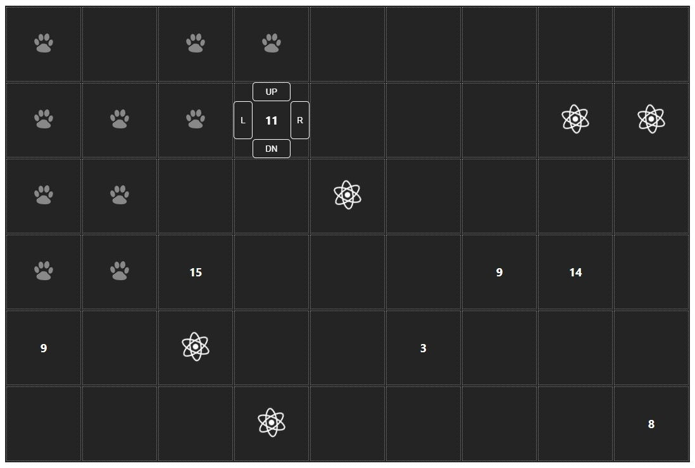
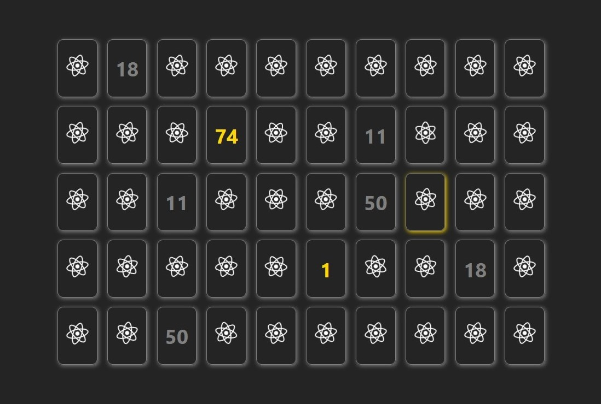
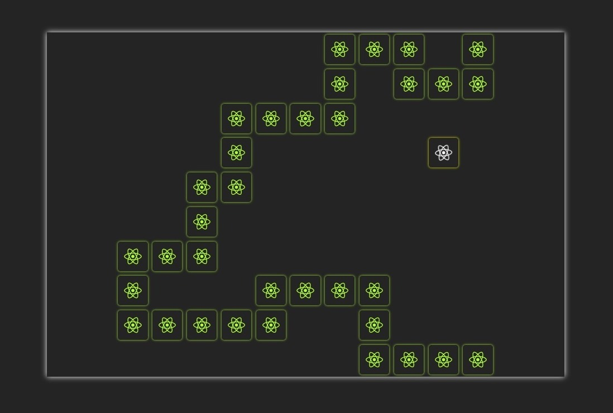
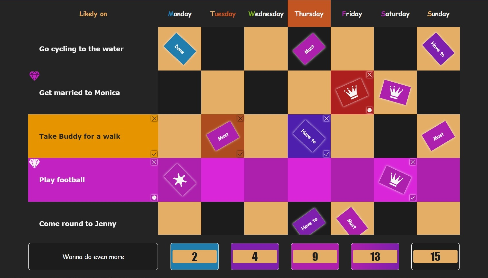
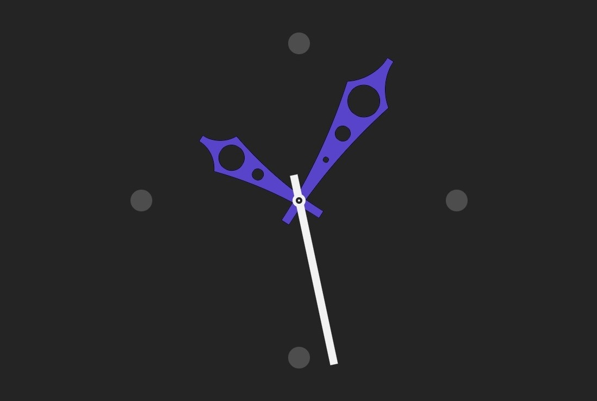

<h1 align="center">
    <a href="#1"><b>Games</b></a> &bull; <a href="#2"><b>Apps</b></a> &bull; <a href="#3"><b>Widgets</b></a> &bull; <a href="#4"><b>Stuff</b></a>
</h1>

## Games

<table>
    <tr>
        <td></td>
        <td></td>
    </tr>
    <tr>
        <td width="50%"><a href="https://github.com/papaproger/magicsquare"><b>Magic Square</b></a> - enjoy your adventure!</td>
        <td width="50%"><a href="https://github.com/papaproger/matchthetiles"><b>Match The Tiles</b></a> - make your brain work!</td>
    </tr>
    <tr>
        <td></td>
        <td></td>
    </tr>
    <tr>
        <td width="50%"><a href="https://github.com/papaproger/simplesnake"><b>Simple Snake</b></a> - remember what it was like!</td>
        <td width="50%"></td>
    </tr>
</table>

<table>
    <tr>
        <td>
            
            
            
            
        </td>
    </tr>
</table>

## Apps

<table>
    <tr>
        <td></td>
    </tr>
    <tr>
        <td><a href="https://github.com/papaproger/activitytable"><b>Activity Table</b></a> - change your life for the better!</td>
    </tr>
</table>

<table>
    <tr>
        <td>
            
            
            
            
            
            
        </td>
    </tr>
</table>

## Widgets

<table>
    <tr>
        <td></td>
        <td></td>
    </tr>
    <tr>
        <td width="50%"><a href="https://github.com/papaproger/animatedclock"><b>Animated Clock</b></a> - create your own custom animation!</td>
        <td width="50%"></td>
    </tr>
</table>

<table>
    <tr>
        <td>
            
            
            
            
            
        </td>
    </tr>
</table>

## Stuff

* **[RuPhoneNumX](https://github.com/papaproger/RuPhoneNumX)** - calculation of the number of your phone number

<table>
    <tr>
        <td>
            
            
            
        </td>
    </tr>
</table>