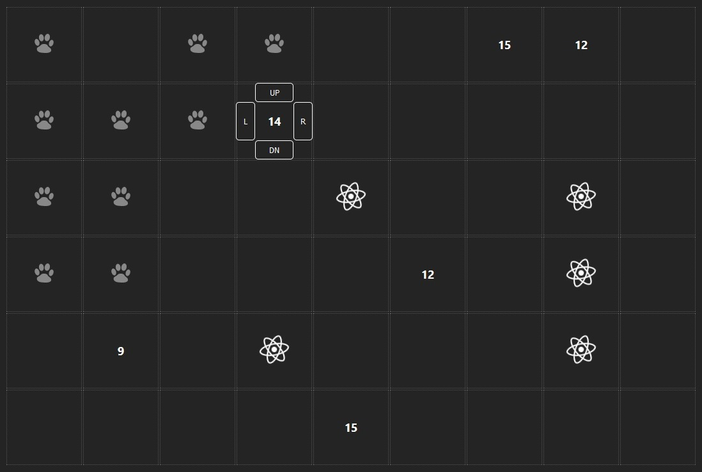
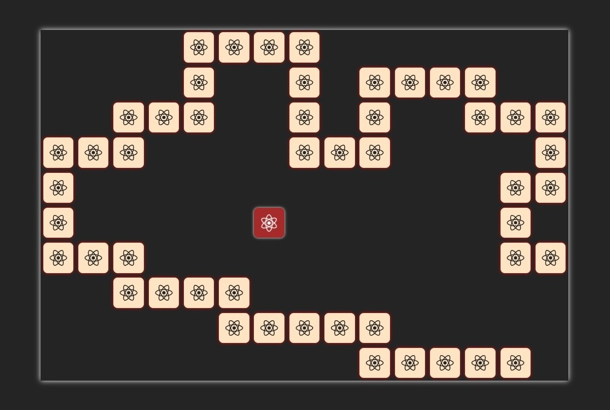

<h1 align="center">
    <a href="#1">𝕲𝖆𝖒𝖊𝖘</a> &bull; <a href="#2">𝕬𝖕𝖕𝖘</a> &bull; <a href="#3">𝕾𝖙𝖚𝖋𝖋</a> &bull; <a href="#4">𝕮𝖔𝖓𝖙𝖆𝖈𝖙𝖘</a>
</h1>

## <a id="1">Games</a>

<table>
    <tr>
        <td></td>
        <td></td>
    </tr>
    <tr>
        <td width="50%"><a href="https://github.com/papaproger/magicsquare"><b>Magic Square</b></a> - enjoy your adventure!</td>
        <td width="50%"><a href="https://github.com/papaproger/matchthetiles"><b>Match The Tiles</b></a> - make your brain work!</td>
    </tr>
    <tr>
        <td></td>
        <td></td>
    </tr>
    <tr>
        <td width="50%"><a href="https://github.com/papaproger/simplesnake"><b>Simple Snake</b></a> - remember what it was like!</td>
        <td width="50%"></td>
    </tr>
</table>

## <a id="2">Apps</a>

<table>
    <tr>
        <td></td>
    </tr>
    <tr>
        <td><a href="https://github.com/papaproger/activitytable"><b>Activity Table</b></a> - change your life for the better!</td>
    </tr>
</table>

## <a id="3">Stuff</a>

* **[RuPhoneNumX](https://github.com/papaproger/RuPhoneNumX)** - calculation of the number of your phone number

## <a id="4">Contacts</a>

[][LinkedIn]

[LinkedIn]: https://www.linkedin.com/in/papaproger/